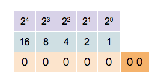
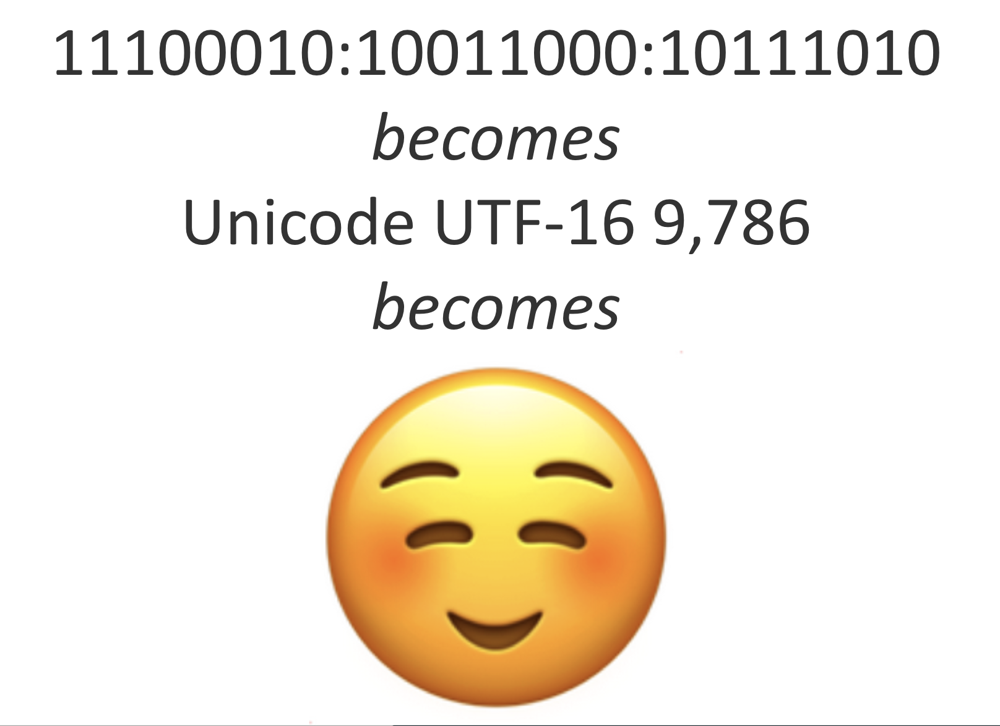
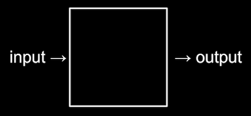

# Hello, World

## What is Computer Programming?

## Computers are dumb; you are smart
- But! They can remember a lot and they're patient

## Binary Numbers

## Boolean Logic

## Context is everything
- Context is called the "environment" in programming
- Information that you can take for granted in the environment is "abstracted-out"

## Abstraction
- Lower-level implementation details are hidden below higher-level ideas, can be taken for granted in the environment
- e.g., music metaphors will work in this programming class because this is a music school

## Representing Data in Computers

## Algorithmic Thinking & Algorithms
- Thinking: breaking the steps of a long operation down into small, explicit substeps and anticipating contingencies
  - Cooking with recipes
- Algorithms: chains of instructions for simple operations that come together to accomplish a complex task

## 20 Questions in Boolean Logic

## Introductions
- Name+Pronoun
- Major+Principal Instrument
- Semester@Berklee
- Recent or Current Project You're Most Excited About
- What operating system are you on?
- How are you doing on storage?

## Big Picture
- Survey of a few languages
- Teaching you to problem-solve patiently, precisely, and creatively to inspire LIFE-LONG LEARNING
- We'll use [participatory live coding](https://journals.plos.org/ploscompbiol/article?id=10.1371/journal.pcbi.1008090) / 'chalk and talk' / code along
- *ALL* the materials of the course are provided for you all together, we'll go through them all together step-by-step
- I am not a graphical thinker, and, with apologies, I'm going to draw a lot
- I am an expert musician, expert educator, competent practitioner programmer  
- I don't know how good you are at coding, but *you* also don't know how good you are at coding
  - [imposter syndrome](https://www.ncbi.nlm.nih.gov/books/NBK585058/#:~:text=Introduction,accomplishments%20among%20high%2Dachieving%20individuals.)
  - [dunning-kreuger effect](https://thedecisionlab.com/biases/dunning-kruger-effect)
- I'm going to try and meet you where you're at, but you gotta tell me where you're at
  - Formative assessment
  - Summative assessment
- I'm trying to meet you *all* where you are, leave no learner behind, so please be patient
  - Occasionally will ask you to pair up (risks vs rewards)
  - Minecraft

## Syllabus (the README.md for this whole repository)

## COMPUTERS: WHAT ARE THEY
- CPU (Central Processing Unit): performs actions
- RAM (Random Access Memory): storage for 0s and 1s (bytes) you're using *right now*
- Hard Drive: persistent storage of 0s and 1s (bytes)
- Motherboard: where everything above comes together

### Vocabulary
- Execution: CPU does what the program tells it to do
- Functions: actions/verbs
- Variables/Bindings: meaning grasps and holds values
- List/array: collection of values
- Loops: cycles/reiterations of execution
- Syntax: expectations information organization

### Processing efficiency of different languages
- in C, lists are stored consecutively in RAM
  - band members all live in consecutive 160 dorm rooms
- in Python, lists are stored at an address in RAM
  - rhythm section live together in Allston, horn section live together in the Fenway
- the less a language forces the CPU to dig around in RAM, the more 'machine-readable' it is
- the more a language forces the CPY to dig around in RAM, the more 'human-readable' it is

**Why and when does efficiency matter?**
**What is the RAM of your machine?**

### Stack vs. Heap
- Stack: part of the RAM that remembers variable and function definitions
- Heap: part of the RAM that remembers data types like lists at an address

## HOMEWORK FOR NEXT CLASS!
