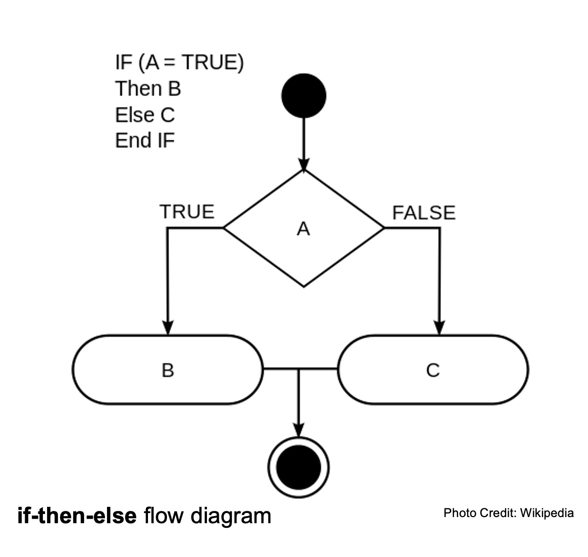

# Scratch

## Vocabulary Review ++
- Execution: CPU does what the program tells it to do
- Functions: actions/verbs
- Variables/Bindings: meaning grasps and holds values
- List/array: collection of values
- Loops: cycles/reiterations of execution
- Syntax: expectations information organization
- Conditions: Check for "Truthiness" with Boolean Logic

## Before you Code

### Pseudocode
- Break down the way to solve to problem into the smallest tasks possible, but in the language you speak to yourself
- Think like a computer, be literal! Algorithmic thinking!

### Simon Says Pseudocode Share and Pair
- Imagine we are each a dancing machine.
- Give us precise instructions for a simple dance using at least one function, at least one condition, and at least one loop.
- I'll do it if you don't want but I'll be tough!

## While you Code

### Pseudocode to start

### Code Reuse
- Stand on the shoulders of giants
- Be a good collaborator

### Always be Documenting
- Documentation outline in the syllabus

## Tower of Babel (Review of Reading)

### Stack vs. Heap Review
- Stack: part of the RAM that remembers variable and function definitions
- Heap: part of the RAM that remembers data types like lists at an address

<!-- maybe add compiler information from here https://prismia.chat/shared/computing-basics
maybe add https://swcarpentry.github.io/shell-novice/ -->

## Command Line

**MAKE SURE your Macintosh HD is visible in your "Finder" Preferences**

**Command Line Interfaces (CLI)**
- Most commonly used for compiled languages
- "under the hood"

***Most common commands***

	- `pwd` Print Working Directory (prints the path to the directory [folder] that you are currently in). Map+Compass.

	- `ls` Lists the files stored in the Working Directory

	- `cd` Change Directory (changes working directory to different directory)
		>You can type `cd` and then drag and drop the folder you'd like to work in, into the Terminal Window. This is much faster than typing out the full path.

	- `clear` clears the Terminal Window

	- `cd ~` change directory to your root directory (how to "go back")

	- `-o` tag to create an object file

	- `say` for fun

## CLI CODE ALONG
	Find a [Haiku](https://www.poetryfoundation.org/learn/glossary-terms/haiku-or-hokku) or other very short poem, or a song lyric refrain. Record an .aiff audio file of your computer "saying" the poem with the CLI
		- Hints:
			- You'll need to use pwd, ls, and cd to make sure you create the .aiff file in a place you can easily find
			- You'll need to use -o:
				`say "hi" -o hi.aiff`

***More advanced commands***

	- `cp` Makes a copy of a file ("cp file.txt filecopy.txt" makes a copy of file.txt and names it filecopy.txt)

	- `mkdir` Makes a new directory (`mkdir NewDirectory` makes a new folder called `NewDirectory`)

	- `&&` Means "and also do this", helpful for inputing multiple commands in the same line

	- `man` opens the manual for Terminal commands ("man man" will open up the manual for the manual!)

	- `~` means home directory

	- `nano` is a text editor within Command-line Interface (you'll see how great it is relative to VSC in a minute)

## [Version Control Systems Overview](https://www.geeksforgeeks.org/version-control-systems/)

### Version Control System Step-up
- [Install Visual Studio Code](https://code.visualstudio.com/download)
- Set up a GitHub.com account with a simple username you can use professionally
- Follow [me](https://github.com/rdwrome)
- Accept my invitation to join the class private repository
- Download and install [GitHub Desktop](https://desktop.github.com/)
- In GitHub Desktop, go to File > Clone Repository and clone the class repository (261)
- Setup GitHub/save the local file path (where the files are on your computer) somewhere you can easily find the files (i.e. Documents, Desktop NOT iCloud!)
- Go to File > New repository
- Create a new repository called "itp"
- Check the box that says "Initialize this repository with a README" and check again that your local file path goes somewhere you can easily find; let the repository stay public (for now)
- Your new repository will appear in the far left bar of the GitHub Desktop window.
- Click on the repository and then select "Publish this repository to GitHub"
- When that has gone through go to Repository > Open in Visual Studio Code (VSC)
- The README.md file of the repository you created for this class will open in VSC

- CODE ALONG TO MAKE A SUBFOLDER FOR SCRATCH

## [Scratch](https://scratch.mit.edu/)
- Sprites: characters
- Costume: image of character
- Threads: how to multi-task
- How to save as an .sb3 file!
