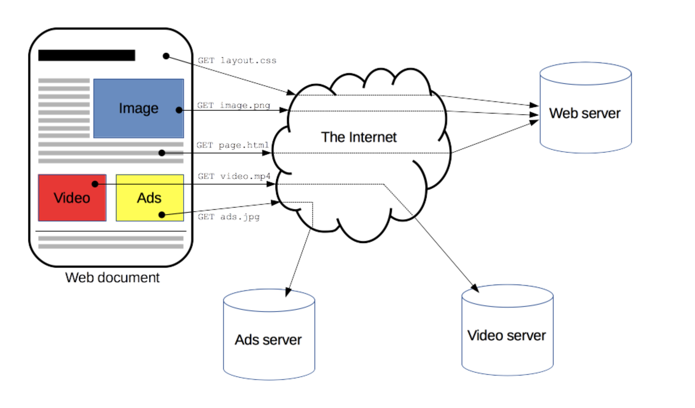
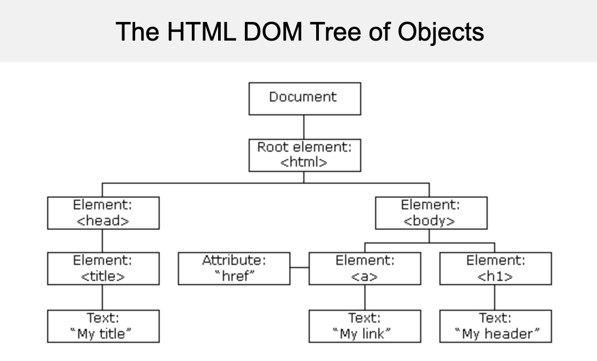
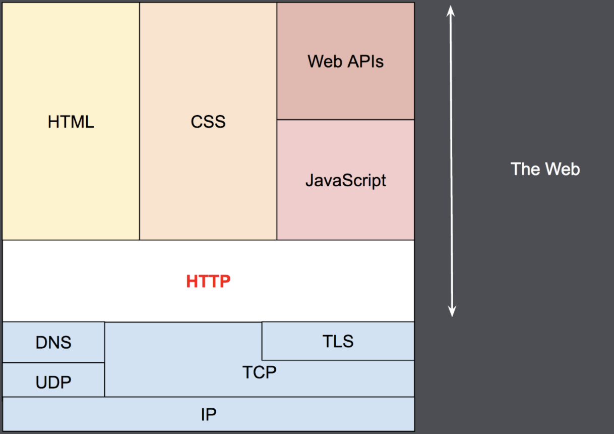

# Network

## [An outstanding Final Project](https://dylanever.itch.io/ibi)

## LMSC-261 recommendations for final projects:
  - P5.js
  - [A-Frame](https://aframe.io/)
  - [RenPy](https://www.renpy.org/)
  - [Adafruit](https://www.adafruit.com/)
  - Useful databases
  - API interactions
  - Portfolio Website

## Housekeeping
  - Final Project Proposal - due next week before class (see FPP.md in this folder)
  - Band Site Project - due next week during class (see Band.md in this the `08Network` folder)

## Anatomy of a Website

## HTML
- HyperText Markup Language
- References something else that can be immediately accessed
- MarkDown is HTML-lite: a text-editor to HTML quick converter.
- HTML: more tags, more structure, more reference options than MarkDown

## Document Object Model
- W3C World Wide Web standard
- "Platform and language-neutral interface that allows programs and scripts to access and update the content, structure, and style of a document"
- Core DOM is standard model for all documents, HTML DOM is for HTML documents

## Servers and Ports
- HTML documents and other assets have to be hosted on servers
- Server: computer (can be virtual!) connected to the internet that can respond to messages for services.
- Port: specifies what kind of service the message is for.
- How do these computers communicate with each other?

## Protocols
- What protocols do you know and love?
  - MIDI?

### Transmission Control Protocol/ Internet Protocol
  - Rules that specify how computers can communicate with each other
  - Internet relies on these protocols to work
  - Early Internet
    - DoD
    - Everything mediated through a mainframe
  - TCP/IP Bundled with Unix in early 70s research computers
    - host-to-host
  - IP addresses mark uniquely identifiable servers
  
  - VPN, anyone?
  - **IPv4 v IPv6**, an interlude:
    - IPv4 could only represent about 4 billion values
    - IPv5 was being designed to be dedicated for streaming
    - IPv6 can represent 2^128 values, beat IPv5 out

### Uniform Resource Locator and Domain Name Search
  - If you type a URL into a browser, the browser uses the DNS to loopk up the IP, then sends a request to the IP for access to the assets on the server.
  - The server doesn't automatically trust the browser (or vice-versa!)

### HyperText Transfer Protocol

  - a client-server protocol
  - browser (client/recipient) requests FETCHING of assets. (Where have we heard that before?)
  - Complete browser page is constructed from different fetched sub-documents (see Anatomy of a Website again.)
  - This is the foundation of information exchange on the internet.
  - Cache (good for you) & Cookies (good for digital capitalism): stored on client side

### All together now:

  - Cascading Style Sheets make sites pretty
    - Inline vs External
  - JavaScript makes sites more interactive, dynamic
  - TLS is for encryption
  - UDP is for ultra-low latency

## Take a look at how it all comes together on your favorite site!
- Open up favorite site in Chrome
- "View">"Developer">"ViewSource"
- Now go through all developer tools

## HTML5 BASICS with [rdwrome.github.io](https://rdwrome.github.io/)
  - Declare HTML5
  - headers
  - paragraphs
  - horizontal rulers
  - blockquotes
  - bold
  - italics
  - breaks
  - anchors
  - images/gifs
  - lists
  - audio
  - divisions
  - css!

## Adding JavaScript!
- Adding P5.js!

- **HTML+CSS Resources**
	- [HTML4 vs. HTML5 and browser info](https://www.wpkube.com/html5-cheat-sheet/)
	- [Declaring HTML5](https://developer.mozilla.org/en-US/docs/Web/Guide/HTML/HTML5/Introduction_to_HTML5)
	- [Complete HTML5 Cheat Sheet](https://websitesetup.org/wp-content/uploads/2019/08/HTML-CHEAT-SHEET.png)
	- [HTML5+CSS3 Demo Websites](https://html5up.net/)
	- [CSS Templates](https://www.w3schools.com/css/)
	- [bootstrap](https://getbootstrap.com/docs/4.3/getting-started/contents/#css-files)

- **[Building a Website with pages.github.com](https://pages.github.com/)**
	- User site
	- GitHub Desktop!
